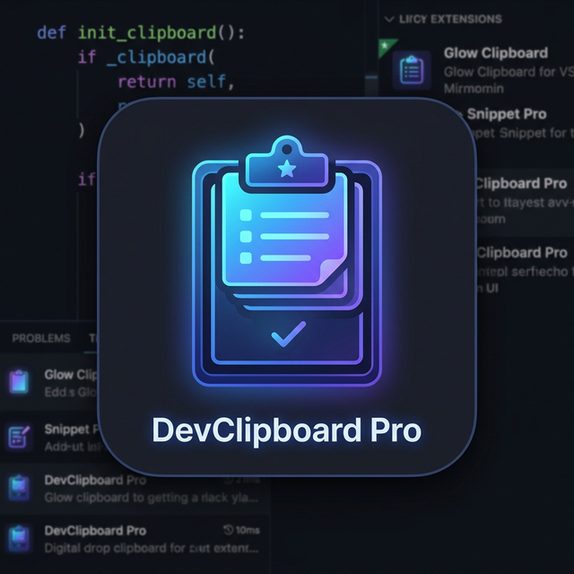

# DevClipboard Pro 🚀

**DevClipboard Pro** is a production-grade, high-performance clipboard manager for Visual Studio Code. Designed for speed, scalability, and modularity, it provides a unified experience across the editor, terminal, and side panel.



## ✨ Key Features

- **Unified Capture**: Seamlessly tracks clipboard content from the editor and integrated terminal.
- **Auto-Classification**: Intelligently detects content types (JSON, SQL, Stack Traces, etc.) using a high-speed regex-based engine.
- **High-Performance UI**: Utilizes `react-window` virtualization to handle thousands of clipboard entries without lag.
- **Smart Deduplication**: Prevents clutter by hashing content (SHA-256) and skipping consecutive duplicates.
- **Search & Filter**: Find exactly what you need with powerful fuzzy search powered by Fuse.js.
- **Persistent Storage**: Robust SQLite backend with Write-Ahead Logging (WAL) for maximum reliability and speed.
- **Pin & Organize**: Keep important snippets locked and easily accessible.
- **Auto-Expiry**: Automatically cleans up old history to keep your workspace lean.
- **Security First**: Optional AES-256-GCM encryption for stored snippets using VS Code's Secret Storage.

## 🛠️ Tech Stack

- **Runtime**: Node.js (LTS)
- **Frontend**: React 18 + Vite + Tailwind-inspired Vanilla CSS
- **Database**: `better-sqlite3`
- **State Management**: Zustand
- **Bundling**: esbuild (Extension) + Vite (Webview)
- **Validation**: Zod
- **Testing**: Vitest + @vscode/test-electron

## 🏗️ Architecture

The extension is built with a loose-coupled service-oriented architecture:

- **ClipboardService**: Core loop for capture and polling.
- **DatabaseService**: Managed persistence layer with prepared statements.
- **ClassifierService**: Worker-thread compatible content analysis.
- **SidebarProvider**: React-based webview integration.

## 🚀 Getting Started

1. **Clone the Repo**:
   ```bash
   git clone https://github.com/vinaynural/vscode-devclipboard-pro.git
   ```
2. **Install Dependencies**:
   ```bash
   npm install
   ```
3. **Run for Development**:
   - Open in VS Code.
   - Press `F5` to start the Extension Development Host.

## 📦 Publishing

This extension is configured for the VS Code Marketplace. See the [Publishing Guide](.gemini/antigravity/brain/publishing_guide.md) for detailed instructions on using `vsce`.

## 📄 License

This project is licensed under the MIT License.
